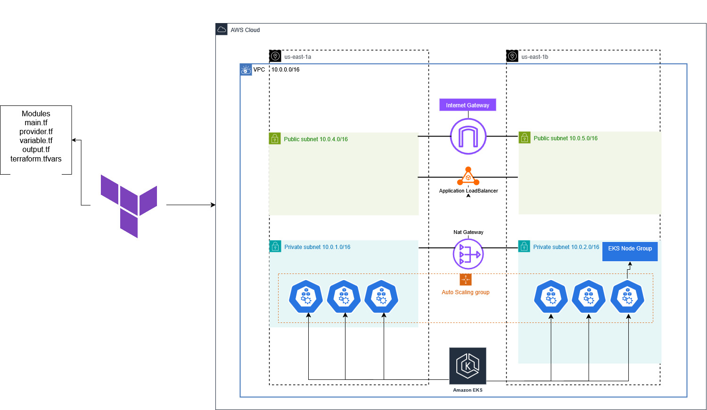

Designed and deployed complete AWS infra using Terraform IaC. Created custom VPC with public/private subnets, EKS cluster, EC2 instances, RDS in private subnet, and an ALB with Auto Scaling. Used separate reusable modules for VPC, EKS, EC2, RDS, Security Groups, IAM, and Load Balancer. Version controlled with GitHub and fully documented. Ensured secure, scalable, and automated infrastructure setup.
        

